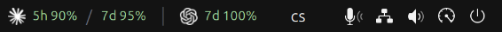
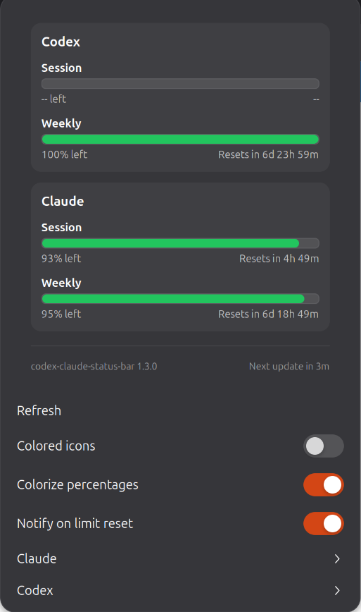

# Codex Claude Status Bar

[](LICENSE)
[](https://gjs.guide/extensions/)
[](https://github.com/ondrejbecva/codex-claude-status-bar/releases/latest)

**Keep an eye on how much of your Claude and Codex AI quota is left — right from
the GNOME top bar.** This extension polls both providers' official usage
endpoints and shows the remaining percentage for each rate-limit window
(5-hour session and 7-day weekly), colour-coded green → yellow → red, with a
click-through breakdown and low-quota notifications. No API keys, no config: it
reads the credential files the Claude Code and Codex CLIs already write.

<p align="center">
  
</p>

<p align="center">
  
</p>

*Above: Codex shows only `7d` because OpenAI reports no 5-hour window on that
plan — the extension drops the window instead of printing `5h --`.*

---

## Features

- **Both providers, both windows** — Claude and Codex, session (5h) + weekly (7d).
- **At-a-glance colour** — green ≥ 70 %, yellow ≥ 30 %, red below.
- **Detail popup** — per-window remaining %, reset countdown, manual refresh.
- **Compact panel** — both providers side by side, each as icon + `5h X% / 7d Y%`.
- **Claude Fable** — optional row + top-bar segment for Claude's model-scoped
  Fable weekly cap.
- **Low-quota alerts** — desktop notification when a window drops below 20 %,
  and again when it resets.
- **Zero setup** — no keys to paste; credentials come from the CLIs.

## Supported platforms

| | Supported |
| --- | --- |
| **Desktop** | GNOME Shell **45 – 50** |
| **Display server** | Wayland **and** X11 |
| **Distros** | Any with GNOME 45+ — e.g. Ubuntu 24.04 / 25.04, Fedora 40+, Debian 13, Arch |
| **Architecture** | Any (pure GJS/JavaScript — no native code) |

Not supported: KDE Plasma / other desktops, macOS, Windows — this is a GNOME
Shell extension. The fetch-and-parse core (`src/lib/`) is plain JavaScript and
portable, so a menu-bar port (e.g. xbar/SwiftBar on macOS) is feasible but not
included here.

> **Wayland note:** GNOME Shell can't hot-reload extension code on Wayland, so a
> newly installed or updated version loads after you **log out and back in**
> (on X11 you can instead run `Alt`+`F2` → `r`).

## Requirements

- GNOME Shell 45–50
- `glib-compile-schemas` (ships with GLib — `glib2` on Fedora/Arch,
  `libglib2.0-bin` on Debian/Ubuntu; usually already present)
- A signed-in **Claude Code** and/or **Codex** CLI (so the credential files
  exist). Either one alone works; the other provider just stays hidden.

## Install

### Quick install (prebuilt zip)

No clone, no build:

```bash
curl -LO https://github.com/ondrejbecva/codex-claude-status-bar/releases/latest/download/codex-claude-status-bar@ondrejbecva.cz.shell-extension.zip
gnome-extensions install --force codex-claude-status-bar@ondrejbecva.cz.shell-extension.zip
gnome-extensions enable codex-claude-status-bar@ondrejbecva.cz
```

Then **log out and back in**.

### From source

```bash
git clone https://github.com/ondrejbecva/codex-claude-status-bar.git
cd codex-claude-status-bar
./install.sh          # copies to ~/.local/share/…, compiles the schema, enables
```

Log out and back in. Uninstall with `./uninstall.sh`.

### Build a zip yourself

```bash
./pack.sh             # -> dist/codex-claude-status-bar@ondrejbecva.cz.shell-extension.zip
```

## Configuration

Click the panel indicator to open the popup; the settings live at the bottom of
that menu.

The top bar always shows each provider as *icon + percentages*; everything else
is per provider, under the **Claude** and **Codex** submenus:

| Option | What it does |
| --- | --- |
| **Show in top bar** | Per provider. Off hides that provider's icon and percentages from the bar; its popup section stays. A provider also hides itself while it has no data. |
| **5h + 7d / 5h only / 7d only** | Per provider — which windows that provider contributes to the bar. Default `5h + 7d`. A window the provider does not report is dropped rather than shown as `--`. |
| **Show Fable usage** (Claude) | Adds a `F Z%` segment to the Claude top-bar group and a **Fable** row in the popup. Reads Claude's model-scoped weekly cap. Off by default; the segment appears only when your account reports a Fable limit. |
| **Icon** (Claude) | Starburst (Claude) vs. bracketed dots (Claude Code) mark. |

Global toggles sit directly in the menu:

| Option | What it does |
| --- | --- |
| **Colorize percentages** | Colour the panel numbers by remaining %. |
| **Colored icons** | Brand-coloured provider icons vs. a mono grey that blends with the bar. |
| **Notify on limit reset** | Desktop notification when a 5h or 7d window hands its quota back. On by default. |

## How it works

Every **3 minutes** the extension refreshes each provider: it reads the local
credential file, refreshes the OAuth access token if needed, calls the usage
endpoint, and normalises the response into remaining-% + reset-time per window.

| Provider | Credentials (read locally) | Token refresh | Usage endpoint |
| --- | --- | --- | --- |
| Claude | `~/.claude/.credentials.json` | `platform.claude.com` | `api.anthropic.com/api/oauth/usage` |
| Codex  | `~/.codex/auth.json` | `auth.openai.com` | `chatgpt.com/backend-api/wham/usage` |

**Codex 5h window:** OpenAI's usage payload currently reports only a 7-day
window for some plans (`secondary_window: null`) — Codex CLI's own `/status`
omits its 5-hour line in exactly that case. When your account does report a 5h
window, it shows up here automatically.

**Privacy:** credentials never leave your machine except as the `Authorization`
bearer on requests to those official provider endpoints. No third-party servers,
no analytics, no telemetry.

## Codex usage-API handling

OpenAI reshaped `chatgpt.com/backend-api/wham/usage`: the 7-day weekly window
now arrives as `primary_window` (`limit_window_seconds: 604800`) with
`secondary_window` often `null`. Parsers that assume a fixed layout
(`primary` = 5h, `secondary` = 7d) mislabel the readout and fail outright when
the secondary is missing.

This extension classifies each window by its own `limit_window_seconds`
(< 1 day → session, ≥ 1 day → weekly) and accepts a single-window response, so
it works with both the old and new payload shapes.
(`src/lib/core/normalize.js`)

## Project layout

```
src/                    # the installable extension (uuid: codex-claude-status-bar@ondrejbecva.cz)
  extension.js          # panel indicator + popup UI
  lib/core/             # scheduler, state, aggregate, normalize (schema parsing), notifications
  lib/providers/        # claude.js, codex.js — fetch + OAuth refresh
  lib/runtime/          # fetch + file-read shims
  lib/ui/render.js      # view-model builder
  schemas/              # GSettings schema
  icons/                # provider SVGs
install.sh  uninstall.sh  pack.sh
```

## Credits & license

MIT — see [LICENSE](LICENSE), which carries the copyright notices for both this
project and the codebase it started from,
[brainusage](https://github.com/AltairInglorious/brainusage) by
AltairInglorious.
